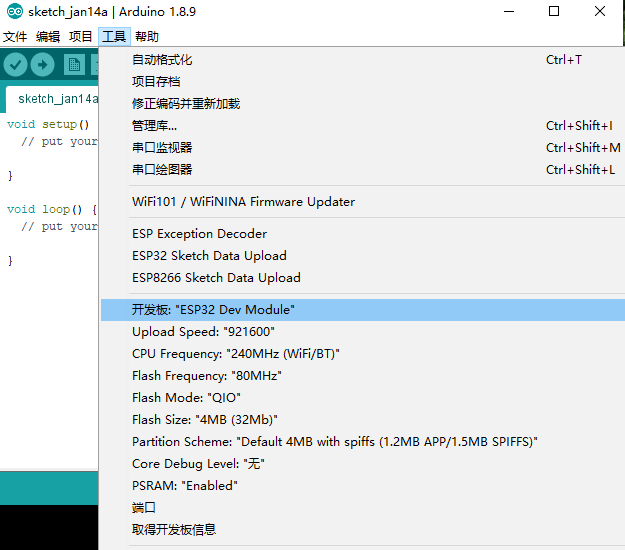
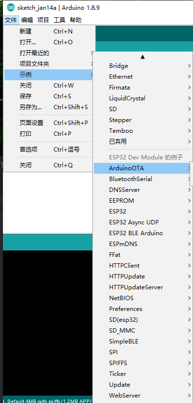
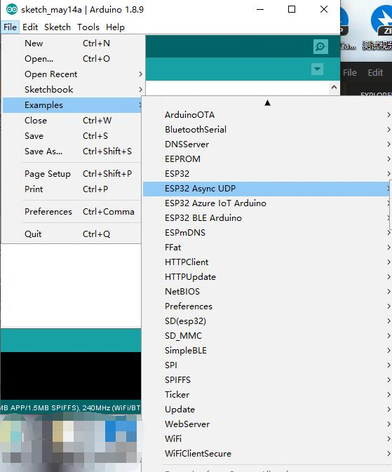

## B站视频教程

1. [Arduino安装ESP32视频教程](https://www.bilibili.com/video/BV1QK411L7Yx/)
2. [LilyGo T-Watch Library视频教程(已经更新了库文件，使用之前请查看github README了解如何选择正确的型号，此视频仅供参考)](https://www.bilibili.com/video/BV1Fe41147aH/)
3. [LilyGo 相机系列视频教程](https://www.bilibili.com/video/BV1Sk4y197Nm/)
4. [LilyGo 墨水屏系列视频教程](https://www.bilibili.com/video/BV1V7411m7b9/)
5. ~~[如何使用LilyGo T-DISPLAY](https://www.bilibili.com/video/BV13f4y1S7ER/)~~ 视频已经过时，请查看README操作
6. [LilyGo K210 上手入门视频](https://www.bilibili.com/video/BV1LV411d7hj/)
7. [LilyGo T-Wristband上手入门视频(这是早期MPU9250版本的视频,后面都是出LSM9DS1版本的,操作步骤类似，请查看README)](https://www.bilibili.com/video/BV12V411R7EL/)


- 如果你的电脑碰巧是`Win10 X64`的,那么你可以到群文件`ESP32 ENV`文件夹中下载`esp32.zip`(如果没了那么就给TX删掉了,请到下方百度云下载),只需要将下载的文件解压到`[你的文档磁盘]:\Documents\Arduino\hardware\espressif`目录下 , 如果没有文件夹,请手动创建子目录,完整路径如下面截图。


    然后你可以打开`Arduino IDE`,依次按下面选择:
    - 工具 -> 开发板 -> 选择ESP32 Dev Modeule , 其他保持默认.
    
    - 文件 -> 示例 -> 在ESP32 Dev Module 示例中挑选一个示例 打开,然后尝试编译,如果编译成功,那么环境就OK了,如果不行,那么你的操作系统与我上传的环境不一致,请跳转到`[你的文档磁盘]:\Documents\Arduino\hardware\espressif\esp32\tools`目录中,双击get.exe,重新拉取编译链,速度快慢取决你的网络.
    

- 如果群文件打开有问题可以去[百度云下载](链接：https://eyun.baidu.com/s/3ggDee1H 密码：APRd)
---------------------------------

### T-Watch/Block/LilyPi 系列
<table border="1">
<tr>
<td>产品</td>
<td>(国内)</td>
<td>(国外)</td>
<td>链接</td>
</tr>
<tr>
<td>T-Watch 2019/2020</a></td>
<td><a href="https://gitee.com/LilyGoX/TTGO_TWatch_Library">GITEE</a></td>
<td><a href="https://github.com/Xinyuan-LilyGO/TTGO_TWatch_Library">GITHUB</a></td>
<td><a href="https://item.taobao.com/item.htm?spm=a1z10.3-c.w4002-23186215236.28.47f3566dLWwfZ6&id=596753123467">淘宝</a></td>
</tr>
<tr>
<td>T-Watch-N</a></td>
<td><a href="https://gitee.com/LilyGoX/TTGO_TWatch_Library">GITEE</a></td>
<td><a href="https://github.com/Xinyuan-LilyGO/TTGO_TWatch_Library">GITHUB</a></td>
<td><a href="https://item.taobao.com/item.htm?spm=a1z10.3-c.w4002-23186215236.20.19d3566dVgdIEg&id=610295051005">淘宝</a></td>
</tr>
<tr>
<td>LilyPi</a></td>
<td><a href="https://gitee.com/LilyGoX/TTGO_TWatch_Library">GITEE</a></td>
<td><a href="https://github.com/Xinyuan-LilyGO/TTGO_TWatch_Library">GITHUB</a></td>
<td><a href="https://item.taobao.com/item.htm?spm=a1z10.3-c.w4002-23186215236.62.df12566dKqD5SD&id=626573236966">淘宝</a></td>
</tr>
<tr>
<td>T-Block</a></td>
<td><a href="https://gitee.com/LilyGoX/TTGO_TWatch_Library">GITEE</a></td>
<td><a href="https://github.com/Xinyuan-LilyGO/TTGO_TWatch_Library">GITHUB</a></td>
<td><a href="https://item.taobao.com/item.htm?spm=a1z10.3-c.w4002-23186215236.50.19d3566dVgdIEg&id=615358902629">淘宝</a></td>
</tr>
<tr>
<td>T-Watch Micropython</a></td>
<td>None</a></td>
<td><a href="https://item.taobao.com/item.htm?spm=a1z10.3-c.w4002-23186215236.28.47f3566dLWwfZ6&id=596753123467">GITHUB</a></td>
</tr>
</table>

#### T-Watch其他
1. [T_Watch_Game](https://github.com/Xinyuan-LilyGO/T_Watch_Game)
2. [TTGO_T_Watch_See_Camera](https://github.com/Xinyuan-LilyGO/TTGO_T_Watch_See_Camera)
3. [TTGO_T_Watch_Baidu_Rec](https://github.com/Xinyuan-LilyGO/TTGO_T_Watch_Baidu_Rec)
4. [LilyGo-TWatch-DataSheet 手表硬件芯片手册仓库](https://github.com/Xinyuan-LilyGO/LilyGo-TWatch-DataSheet)
5. 关于T-Watch NFC底板的问题，例程参考[Adafruit-PN532](https://github.com/adafruit/Adafruit-PN532)的,具体如何使用请查看示例
6. TWATCH 系列出厂固件:链接：https://eyun.baidu.com/s/3i6CZXv3 密码：Rjuw
#### TWatch & FAQ:
1. 购买了T-Watch还需要买编程器吗?
    - 不需要,ESP32使用串口下载方式,T-Watch内部已经设计了串口下载电路
2. T-Watch 无法下载?
    - 参见下面FAQ


---------------------------------

### K210 C/C++
1. [K210 SDK , Documentations ](https://canaan-creative.com/developer)
2. [Kendryte IDE](http://kendryte-ide.s3-website.cn-northwest-1.amazonaws.com.cn/)
3. [kendryte-standalone-demo](https://github.com/kendryte/kendryte-standalone-demo)
4. [kendryte-freertos-sdk](https://github.com/kendryte/kendryte-freertos-sdk)

### K210 Micropython文档源码
1. [MaixPy doc](https://maixpy.sipeed.com/zh/)
2. [MaixPy examples](https://github.com/Xinyuan-LilyGO/LilyGo-K210-Script)
3. [MaixPy Src](https://github.com/Xinyuan-LilyGO/MaixPy)
   
---------------------------------

### ESP32S2 系列
<table border="1">
<tr>
<td>示例代码</td>
<td>购买链接</td>
</tr>
<tr>
<td><a href="https://github.com/Xinyuan-LilyGO/LilyGo-esp32s2-base">ESP32S2 板载芯片</a></td>
<td><a href="https://item.taobao.com/item.htm?spm=a1z10.3-c.w4002-23186215236.62.5d82566dk4HQrU&id=619203880091">淘宝</a></td>
</tr>
<tr>
<td><a href="https://github.com/Xinyuan-LilyGO/LilyGo-esp32s2-base">ESP32S2 板载模块</a></td>
<td><a href="https://item.taobao.com/item.htm?spm=a1z10.3-c.w4002-23186215236.71.5d82566dk4HQrU&id=620031587367">淘宝</a></td>
</tr>
</table>


### ESP32C3 系列
<table border="1">
<tr>
<td>示例代码</td>
<td>购买链接</td>
</tr>
<tr>
<td><a href="https://github.com/Xinyuan-LilyGO/LilyGo-T-OI-PLUS">T-OI-PLUS</a></td>
<td><a href="">淘宝</a></td>
</tr>
<tr>
<td><a href="https://github.com/Xinyuan-LilyGO/T-Color">T-Color</a></td>
<td><a href="">淘宝</a></td>
</tr>
</tr>
<tr>
<td><a href="https://github.com/Xinyuan-LilyGO/T-01C3">T-01C3</a></td>
<td><a href="">淘宝</a></td>
</tr>
</table>
---------------------------------

### T-Wristband 手环系列

<table border="1">
<tr>
<td>示例代码</td>
<td>购买链接</td>
</tr>
<tr>
<td><a href="https://github.com/Xinyuan-LilyGO/LilyGo-T-Wristband">ESP32版本</a></td>
<td><a href="https://item.taobao.com/item.htm?spm=a1z10.1-c.w4004-23186202528.2.16df19e1xNYvNX&id=632730722887">淘宝</a></td>
</tr>
<tr>
<td><a href="https://github.com/Xinyuan-LilyGO/LilyGo-T-Wristband-NRF52">NRF52832版本</a></td>
<td><a href="https://item.taobao.com/item.htm?spm=a1z10.1-c.w4004-23186202528.2.16df19e1xNYvNX&id=632730722887">淘宝</a></td>
</tr>
<tr>
<td><a href="https://github.com/Xinyuan-LilyGO/LilyGo-T-Wristband-S76G">S76G版本</a></td>
<td><a href="">淘宝</a></td>
</tr>
</table>

- Note: NRF52832 手环SWD接口对应下载板接口
- SWCLK----IO14     SWDIO---IO12
---------------------------------

### OLED系列

<table border="1">
<tr>
<td>示例代码</td>
<td>购买链接</td>
</tr>
<tr>
<td><a href="https://github.com/Xinyuan-LilyGO/LilyGo-TTV">LilyGo-TTV</a></td>
<td><a href="https://item.taobao.com/item.htm?spm=a1z10.1-c.w4004-23186202528.22.3ed519e1oMIAkt&id=630560045364">淘宝</a></td>
</tr>
</table>

---------------------------------

### LCD系列

<table border="1">
<tr>
<td>示例代码</td>
<td>购买链接</td>
</tr>
<tr>
<td><a href="https://github.com/Xinyuan-LilyGO/LilyGo-HeartRate-Kit">LilyGo-HeartRate-Kit</a></td>
<td><a href="https://item.taobao.com/item.htm?spm=a1z10.3-c.w4002-23186215236.56.7920566d7QNVoN&id=625931128254">淘宝</a></td>
</tr>
<tr>
<td><a href="https://github.com/Xinyuan-LilyGO/TTGO-T-Display">T-Display ESP32版本</a></td>
<td><a href="https://item.taobao.com/item.htm?spm=a1z10.3-c.w4002-23186215236.10.7edf566dKo8k3A&id=597352197769">淘宝</a></td>
</tr>
<tr>
<td><a href="https://github.com/Xinyuan-LilyGO/LilyGO-T-DisplayGD32">T-Display GD32版本</a></td>
<td><a href="https://item.taobao.com/item.htm?spm=a1z10.3-c.w4002-23186215236.35.5fa0566dibclWR&id=611309878542">淘宝</a></td>
</tr>
<tr>
<td><a href="https://github.com/Xinyuan-LilyGO/LilyGo-T-Display-S2">T-Display ESP32S2版本</a></td>
<td><a href="https://item.taobao.com/item.htm?spm=a1z10.3-c.w4002-23186215236.23.7920566d7QNVoN&id=622656830524">淘宝</a></td>
</tr>
<tr>
<td><a href="https://github.com/Xinyuan-LilyGO/Ka-Radio32">TTGO TM 2.4'inc</a></td>
<td><a href="https://item.taobao.com/item.htm?spm=a1z10.3-c.w4002-23186215236.17.7c21566dw72Fv5&id=591989131784">淘宝</a></td>
</tr>
<tr>
<td><a href="">TTGO T-Gallery 2.4'inc </a></td>
<td><a href="https://item.taobao.com/item.htm?spm=a1z10.3-c.w4002-23186215236.44.7c21566dw72Fv5&id=585178114317">淘宝</a></td>
</tr>
<tr>
<td><a href="https://github.com/Xinyuan-LilyGO/LilyGo_Txx">TTGO TSV(T10)</a></td>
<td><a href="https://item.taobao.com/item.htm?spm=a1z10.3-c.w4002-23186215236.41.7c21566dw72Fv5&id=585052548929">淘宝</a></td>
</tr>
<tr>
<td><a href="https://github.com/Xinyuan-LilyGO/LilyGo_Txx">TTGO T-Watcher(T14)</a></td>
<td><a href="https://item.taobao.com/item.htm?spm=a1z10.3-c.w4002-23186215236.77.7c21566dw72Fv5&id=592095853437">淘宝</a></td>
</tr>
</table>


* [GD32VF103 固件库和编程开发文档地址](http://www.gd32mcu.com/cn/download/7?kw=GD32VF1)


---------------------------------

### T-HiGrow 土壤系列

<table border="1">
<tr>
<td>示例代码</td>
<td>购买链接</td>
</tr>
<tr>
<td><a href="https://github.com/Xinyuan-LilyGO/TTGO-HiGrow">T-HiGrow Dashboard</a></td>
<td><a href="https://item.taobao.com/item.htm?spm=a1z10.3-c.w4002-23186215236.20.7c21566dw72Fv5&id=602121057215">淘宝</a></td>
</tr>
<tr>
<td><a href="https://github.com/Xinyuan-LilyGO/LilyGO-T-HiGrow-LoRaWLAN">T-Higrow LoRaWLAN</a></td>
<td><a href="https://item.taobao.com/item.htm?spm=a1z10.3-c.w4002-23186215236.47.7920566d7QNVoN&id=624744530298">淘宝</a></td>
</tr>
<tr>
<td><a href="https://github.com/Xinyuan-LilyGO/T-HiGrow-Dashboard">T-HiGrow Cayenne</a></td>
<td><a href="https://item.taobao.com/item.htm?spm=a1z10.3-c.w4002-23186215236.20.7c21566dw72Fv5&id=602121057215">淘宝</a></td>
</tr>
</table>


---------------------------------

### SIMCom 系列

<table border="1">
<tr>
<td>示例代码</td>
<td>购买链接</td>
</tr>
<tr>
<td><a href="https://github.com/Xinyuan-LilyGO/LilyGo-T-Call-SIM800">T-Call SIM800L</a></td>
<td><a href="https://item.taobao.com/item.htm?spm=a1z10.3-c.w4002-23186215236.31.a7f2566dhq90Le&id=597527871141">淘宝</a></td>
</tr>
<td><a href="https://github.com/Xinyuan-LilyGO/LilyGo-T-Call-SIM800">T-Call SIM800C</a></td>
<td><a href="https://item.taobao.com/item.htm?spm=a1z10.3-c.w4002-23186215236.44.7920566d7QNVoN&id=624599939345">淘宝</a></td>
</tr>
<tr>
<td><a href="https://github.com/Xinyuan-LilyGO/LilyGO-T-SIM7000G">T-SIM7000G</a></td>
<td><a href="https://item.taobao.com/item.htm?spm=a1z10.3-c.w4002-23186215236.17.845c566dqcnqps&id=610229292079">淘宝</a></td>
</tr>
<tr>
<td><a href="https://github.com/Xinyuan-LilyGO/LilyGo-T-PCIE">T-PCIE</a></td>
<td><a href="https://item.taobao.com/item.htm?spm=a1z10.3-c.w4002-23186215236.14.7920566d7QNVoN&id=620353381386">淘宝</a></td>
</tr>
<tr>
<td><a href="https://github.com/Xinyuan-LilyGO/LilyGO-T-SIM7600X">T-SIM7600X</a></td>
<td><a href="">淘宝</a></td>
</tr>
</tr>
<tr>
<td><a href="https://github.com/Xinyuan-LilyGO/LilyGO-T-A7670X">T-A7670</a></td>
<td><a href="">淘宝</a></td>
</tr>
</tr>
<tr>
<td><a href="https://github.com/Xinyuan-LilyGO/LilyGO-T-A7608X">T-A7608</a></td>
<td><a href="">淘宝</a></td>
</tr>
</table>

---------------------------------

### 摄像头系列

<table border="1">
<tr>
<td>示例代码</td>
<td>购买链接</td>
</tr>
<tr>
<td><a href="https://github.com/Xinyuan-LilyGO/LilyGo-Camera-Series">T-Camera</a></td>
<td><a href="https://item.taobao.com/item.htm?spm=a1z10.3-c.w4002-23186215236.19.2e94566deBldmV&id=591544649704">淘宝</a></td>
</tr>
<tr>
<td><a href="https://github.com/Xinyuan-LilyGO/LilyGo-Camera-Series">T-CameraPlus Arduino</a></td>
<td><a href="https://item.taobao.com/item.htm?spm=a1z10.3-c.w4002-23186215236.22.2e94566deBldmV&id=592202271583">淘宝</a></td>
</tr>
<tr>
<td><a href="https://github.com/Xinyuan-LilyGO/esp32-camera-screen">T-CameraPlus ESP-IDF</a></td>
<td><a href="https://item.taobao.com/item.htm?spm=a1z10.3-c.w4002-23186215236.22.2e94566deBldmV&id=592202271583">淘宝</a></td>
</tr>
<tr>
<td><a href="https://github.com/Xinyuan-LilyGO/esp32-camera-plus-bigiot">T-CameraPlus BIGIOT</a></td>
<td><a href="https://item.taobao.com/item.htm?spm=a1z10.3-c.w4002-23186215236.22.2e94566deBldmV&id=592202271583">淘宝</a></td>
</tr>
<tr>
<td><a href="https://github.com/Xinyuan-LilyGO/LilyGo-Camera-Series">T-Journal</a></td>
<td><a href="https://item.taobao.com/item.htm?spm=a1z10.3-c.w4002-23186215236.14.38e8566deOJbbF&id=590931728875">淘宝</a></td>
</tr>
<tr>
<td><a href="https://github.com/Xinyuan-LilyGO/TTGO_Camera_Mini">T-Camera mini</a></td>
<td><a href="https://item.taobao.com/item.htm?spm=a1z10.3-c.w4002-23186215236.38.77d1566dItIRJ1&id=607325578174">淘宝</a></td>
</tr>
</table>

---------------------------------

### 墨水屏系列

<table border="1">
<tr>
<td>示例代码</td>
<td>购买链接</td>
</tr>
<tr>
<td><a href="https://github.com/Xinyuan-LilyGO/LilyGo-T5-ink-series">T5 V2.13/V2.2/V2.4/V2.8基础示例</a></td>
<td><a href="https://item.taobao.com/item.htm?spm=a1z10.3-c.w4002-23186215236.67.47f3566dLWwfZ6&id=593151946301">淘宝</a></td>
</tr>
</tr>
<tr>
<td><a href="https://github.com/Xinyuan-LilyGO/T5-Ink-Screen-Series">T5 电子徽章</a></td>
<td><a href="">淘宝</a></td>
</tr>
<tr>
<td><a href="https://github.com/Xinyuan-LilyGO/LilyGo-T5-ink-series">T5S V24版本</a></td>
<td><a href="https://item.taobao.com/item.htm?spm=a1z10.3-c.w4002-23186215236.59.624a566dQZNpaj&id=592301675595">淘宝</a></td>
</tr>
<tr>
<td><a href="https://github.com/Xinyuan-LilyGO/LilyGo-eink-v2.3-micropython">T5 V2.13 Micropython</a></td>
<td><a href="https://item.taobao.com/item.htm?spm=a1z10.3-c.w4002-23186215236.16.47f3566dLWwfZ6&id=592727637336">淘宝</a></td>
</tr>
<tr>
<td><a href="https://github.com/Xinyuan-LilyGO/LilyGo-EPD47">T5 4.7寸</a></td>
<td><a href="https://item.taobao.com/item.htm?spm=a1z10.1-c-s.w4004-23186202528.6.51de19e1NgGAGX&id=634979479882">淘宝</a></td>
</tr>
<tr>
<td><a href="https://github.com/Xinyuan-LilyGO/LilyGo-T5-Grayscale">T5 V2.13 4灰阶</a></td>
<td><a href="https://item.taobao.com/item.htm?spm=a1z10.1-c-s.w4004-23186202528.10.7f1419e1AjaPv2&id=636335781892">淘宝</a></td>
</tr>
<tr>
<td><a href="https://github.com/Xinyuan-LilyGO/LilyGO-Mini-Epaper">Mini Epaper</a></td>
<td><a href="https://item.taobao.com/item.htm?spm=a1z10.1-c-s.w4004-23186202528.10.7f1419e1AjaPv2&id=636335781892">淘宝</a></td>
</tr>

</table>

* 关于EPD47 墨水屏气象站代码不在github中,请在群文件中下载


---------------------------------

### 以太网系列

<table border="1">
<tr>
<td>示例代码</td>
<td>购买链接</td>
</tr>
<tr>
<td><a href="https://github.com/Xinyuan-LilyGO/LilyGO-T-ETH-POE">T-Internet-POE</a></td>
<td><a href="https://item.taobao.com/item.htm?spm=a1z10.3-c.w4002-23186215236.80.6ab3566dpANnXA&id=619965661139">淘宝</a></td>
</tr>
</tr>
<tr>
<td><a href="https://github.com/Xinyuan-LilyGO/LilyGo-W5500-Lite">T-Lite W5500</a></td>
<td><a href="https://item.taobao.com/item.htm?spm=a1z10.3-c.w4002-23186215236.41.4c80566dXymhW0&id=624427812085">淘宝</a></td>
</tr>
</table>


---------------------------------

### 单板系列

<table border="1">
<tr>
<td>示例代码</td>
<td>购买链接</td>
</tr>
<tr>
<td><a href="https://github.com/LilyGO/TTGO-T-ControllerV2.2">T-Controller</a></td>
<td><a href="https://item.taobao.com/item.htm?spm=a1z10.3-c.w4002-23186215236.56.624a566dQZNpaj&id=585836432175">淘宝</a></td>
</tr>
</table>

---------------------------------

### LoRa系列

<table border="1">
<tr>
<td>示例代码</td>
<td>购买链接</td>
</tr>
<tr>
<td><a href="https://github.com/Xinyuan-LilyGO/LilyGO-T-Motion"> T-Motion</a></td>
<td><a href="https://item.taobao.com/item.htm?spm=a1z10.3-c.w4002-23186215236.41.18ee566dqR0a68&id=612960266394">淘宝</a></td>
</tr>
<tr>
<td><a href="https://github.com/Xinyuan-LilyGO/LilyGO-T-Beam">T-Beam</a></td>
<td><a href="https://item.taobao.com/item.htm?spm=a1z10.3-c.w4002-23186215236.52.726e566dtpPljz&id=584916194980">淘宝</a></td>
</tr>
<tr>
<td><a href="https://github.com/Xinyuan-LilyGO/T-solar"> T-Solar</a></td>
<td><a href="https://item.taobao.com/item.htm?spm=a1z10.3-c.w4002-23186215236.41.1e9a566dAU2jit&id=607916351812">淘宝</a></td>
</tr>
<tr>
<td><a href="https://github.com/Xinyuan-LilyGO/LilyGO-T-Beam">LoRa V2.0 </a></td>
<td><a href="https://item.taobao.com/item.htm?spm=a1z10.3-c.w4002-23186215236.50.1e9a566dAU2jit&id=600473094485">淘宝</a></td>
</tr>
<tr>
<td><a href="https://github.com/Xinyuan-LilyGO/SX1302_HAL_GATEWAY">TTGO T-SX1302 </a></td>
<td><a href="https://item.taobao.com/item.htm?spm=a1z10.3-c.w4002-23186215236.65.5d2a566dqpXh2w&id=626594399044">淘宝</a></td>
</tr>
<tr>
</table>


---------------------------------

### VAG系列


<table border="1">
<tr>
<td>示例代码</td>
<td>购买链接</td>
</tr>
<tr>
<td><a href="https://github.com/fdivitto/FabGL"> TTGO VGA32</a></td>
<td><a href="https://item.taobao.com/item.htm?spm=a1z09.2.0.0.4a3c2e8dNfPn0V&id=596691871822&_u=i1jqu3nc058&qq-pf-to=pcqq.group">淘宝</a></td>
</tr>
</table>
---------------------------------

### 其他
1. [BBQ Keyboard Driver](https://github.com/Xinyuan-LilyGO/bbq10kbd_i2c_sw)

---------------------------------


## 图形编程
- [图形编程百度云地址](https://pan.baidu.com/s/1VAbl8_A8FZ1fasJG4GrmiQ)(提取码：exjz)
- [Pictoblox 官网](https://thestempedia.com/product/pictoblox/download-pictoblox/)
- [kbide 官网](https://kbide.org/)


---------------------------------

## 文档
[T-Watch esp32 Version 入门篇及文档](https://t-watch.readthedocs.io/zh_CN/latest/)

---------------------------------

## 常用工具
[Imageconverter565](http://www.rinkydinkelectronics.com/t_imageconverter565.php)

---------------------------------


## ESP32 资源文档
1. [esp-idf 乐鑫官方SDK ](https://github.com/espressif/esp-idf)
2. [esp32 官方文档](https://docs.espressif.com/projects/esp-idf/en/latest/esp32/get-started/)
3. [esp32-s2 官方文档](https://docs.espressif.com/projects/esp-idf/en/latest/esp32s2/get-started/)
4. [micropython-esp32](http://micropython.org/download/esp32/)
5. [lua-esp32](https://github.com/nodemcu/nodemcu-firmware)
6. [arduino-esp32](https://github.com/espressif/arduino-esp32)
---------------------------------

## FAQ
1. 板子拿到手该怎么安装Arduino ? 
    - 看这里[arduino安装esp32视频教程](https://www.bilibili.com/video/BV1QK411L7Yx/)
2. 如何安装驱动?
    -  一般Win10会自动安装,如果使用了别的系统那么[点击这里下载](https://www.silabs.com/products/development-tools/software/usb-to-uart-bridge-vcp-drivers)
4. 安装了驱动,如何查看驱动是否安装成功?
    - 在 我的电脑右键选择设备管理器,查看端口列表中是否有多一个设备,不清楚的话先把板子先拔下，然后再插入,看看设备管理器中是否有变化,如果有变化那么就安装好驱动了.
    - 如果安装了还是没端口,那么请换台电脑试试,如果还是不行,请联系客服
5. 当Arduino中没有我购买板子的名称时候我要选择哪个板子 ? 
    - 选择`ESP32 Dev Moudule`
6. 当上传程序时候遇见下面日志时候该如何处理?
   ```
    esptool.py v2.6
    Serial port COMxx
    Connecting........_____....._____....._____....._____....._____....._____....._____

    A fatal error occurred: Failed to connect to ESP32: Timed out waiting for packet header
    A fatal error occurred: Failed to connect to ESP32: Timed out waiting for packet header
   ```
    1.请先查看串口驱动是否已经被安装正确，查看第四点，或者更换下载数据线，更换USB端口，或者直接更换电脑测试。

    2. 如果使用T-Watch，SIM800L,T-SIM，之类带AXP202,AXP192之类的电源管理芯片的板子，你需要先确保电源已经被开启，正常开启是按住电源键两秒后松开，这时候为开启，而关闭一般没改动程序情况下，默认按6秒为关闭电源
   
    3. 如果使用不带电源管理芯片的板子，首先查看板子是否有物理开关，如T8一类的板子，需要将开关拨动到ON一段，开启后再次尝试
   
    4. 如果电源开启后，还是无法上传，请检查Arduino中选项中的端口号是否选择正确

    5. 如果还是无法上传，如果有BOOT键的板子，那么先按住BOOT键，保持不放开，然后再次按下RST复位键，然后松开两个按键，此时芯片处于下载模式，再次点击上传

    6. 如果没有BOOT键的，那么查看板子是否有IO0的接口，如T8已经将IO0被引出，此时可以短接IO0，然后按下复位键，同样可以进入下载模式。

    7. 通过以上手段还是无法顺利下载，请联系客服申请更换

7. 有没有蓝牙通讯或者WiFi通讯的示例,或者更多的示例?
    - 安装ESP32 板子到Arduino中后,自带全部功能的示例程序,你可以在`Arduino` -> `File` -> `Examples`中查看到
    
8. 驱动,Arduino都装好了,如何使用?
   - 查看上面的所有示例代码与你购买板子对应的名称,点击跳转查看跳转仓库下方的README,按照上面的要求设置,如果看不明白,请看看最上面的B站视频,随便看一个都行,步骤都差不多
9.  xxx款板子,待机如何 功耗如何 ?
    - 只能提供一个参考的深度睡眠的消耗电流,至于工作电流,根据应用程序而定.
10. 我能否使用3.7V的锂电池 或者 18650 的电池给板子供电 ?
    - 只要板子上有电池接口都可以,如果板子没有电池接口,那么可以查看板子有没Vin或者5V的标志,如果有那么也可以接那里,这个一般都为USB电压输入,所以当这样接的时候 请不要插USB电源,如果还是不了解,请联系客服
11. 我能否使用外接电源供电?
    - 查看板子有没Vin或者5V的标志,如果有那么也可以接那里,这个一般都为USB电压输入,所以当这样接的时候 请不要插USB电源,如果还是不了解,请联系客服
12. 我需要原理图,去哪儿找?
    - 一般原理图都和程序放在一个仓库,请查看上面的示例代码列表,如果没有,请联系客服添加
13. 有没有Micropython或者别的语言的示例程序?
    - 没有,我们只提供Arduino的示例测试代码
14. 在哪儿可以购买你们的板子 ?
    - 在淘宝网中搜索LilyGo,看到LilyGo品牌店就是我们的淘宝店铺
    - 链接:https://shop135629592.taobao.com/
15. 我下载的库要放在哪里 ?
    - 在不更改Arduino设置的情况下，都是放在 我的电脑->我的文档->Arduino->libraries 这个目录内
16. 安装完Arduino for esp32 之后点击编译报错误 "open NUL: The System cannot find the file specified"
    - 这是系统不符合要求，请换个系统重新安装
17. Arduino 提示xxx无效库是什么情况 ?
    - 不用管它
18. 新买的手表或者板子,识别到了端口，但是板子没反应，或者显示屏没有显示，是不是坏了?
    - 是否自己刷过程序? 我们板子或者手表出厂默认都写有固件，有显示屏的会显示的,请确认是否自己刷过?
    - 没有刷过程序,你可以先连接串口查看是否有信息打印,手表或者带电源管理的板子需要按开机键，长按6秒关机,然后再按2秒会开机，查看串口是否有打印,如果有打印信息,那么代表主板工作正常,无显示可能是漏网之鱼,请自己刷新我们的示例程序或者固件尝试
    - 如果上述方法都不奏效,联系客服，说明原因要求更换
19. 如何读取电池电压?
    - [参考这里](https://github.com/Xinyuan-LilyGO/LilyGo-EPD47/blob/dc05af2a794185abf3540b6027b6ab2a13ec63c6/examples/demo/demo.ino#L115)，只需要把IO口更改为你板子的IO口即可(注意，是ADC检测部分，不是全部复制)，一般LilyGo的板子默认ADC Pin都是IO35，特殊的除外，不确定可以查看原理图或者询问管理,


