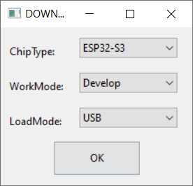

# Flash firmware in windows

Download [Flash_download_tool](https://www.espressif.com.cn/sites/default/files/tools/flash_download_tool_3.9.3_0.zip)

Select ESP32 in ChipTpe for integrated ESP32 chip

Select ESP32s3 in ChipTpe for integrated ESP32-S3 chip

Select according to the following figure, finally select `START`, press `RST` after writing, or power on again, and then observe the log output from the serial port

    

Unable to write please check [here](./EnterDownloadMode.md)

